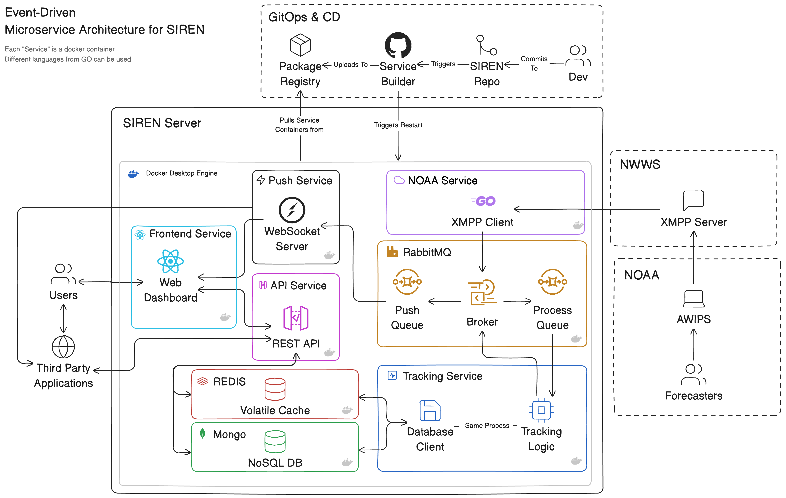

<div align="center">

<picture>
        <source media="(prefers-color-scheme: dark)" srcset="https://raw.githubusercontent.com/jaxcksn/jaxcksn/main/files/ttu_cs_dark.png">
        
</picture>

# SIREN: Service for Immediate Relay of Emergency Notification

</div>

> SIREN is a powerful, automated service designed to listen for and track National Weather Service (NWS) alerts in real-time. It provides a web interface and push service for relay of these alerts.

## Table of Contents

1. [System Design](#system-design)
   - [Architecture Diagram](#architecture-diagram)
   - [Sequence Diagram](#sequence-diagram)
2. [Getting Started](#getting-started)
   - [Prerequisites](#prerequisites)
   - [Installation](#installation)
   - [Running the Project](#running-the-project)
   - [Optional: Running Manually](#optional:-running-manually)
3. [Created By](#created-by)

# System Design

### Architecture Diagram

<picture>
<source media="(prefers-color-scheme: dark)" srcset="docs/siren_arch_dark.png">

</picture>

### Sequence Diagram

<picture>
<source media="(prefers-color-scheme: dark)" srcset="docs/siren_seq_dark.png">

</picture>

# Getting Started

## Prerequisites

The following needs to be installed on your system:

- [Git](https://git-scm.com/)
- [Docker Desktop](https://www.docker.com/)
- [Go (Golang)](https://go.dev/dl/) (Latest Stable)
- [Node.js LTS](https://nodejs.org/en) (v22)
- [Visual Studio Code (VSCode)](https://code.visualstudio.com/)

## Installation

1. **Clone the Repo**

```bash
git clone <repository-url>
cd SIREN
```

2. **Install Dependencies**

- **Go Dependencies:**

  ```bash
  cd services/noaa-service
  go mod tidy
  cd ../tracking-service
  go mod tidy
  ```

- **Node Dependencies:**

  ```bash
  cd ../frontend-service
  npm install
  cd ../api-service
  npm install
  cd ../push-service
  npm install
  ```

## Running the Project

### Step 1: Start Docker Compose

In the root directory, start the Docker containers:

```bash
docker compose up -d
```

### Step 2: Launch Services in VSCode

1. Open the root directory in VSCode:

   ```bash
   code .
   ```

2. Use the preconfigured launch configurations to start the services in this order:

   1. **Launch NOAA Service**
   2. **Launch Tracking Service**
   3. **Launch API Service**
   4. **Launch Push Service**
   5. **Launch Frontend**

Alternatively, you can run the compound configuration:

- **Launch All Services**

## Optional: Running Manually

If needed, the services can be started manually:

1. **NOAA Service**

   ```bash
   cd services/noaa-service
   go run main.go
   ```

2. **Tracking Service**

   ```bash
   cd services/tracking-service
   go run main.go
   ```

3. **API Service**

   ```bash
   cd services/api-service
   npm run dev
   ```

4. **Push Service**

   ```bash
   cd services/push-service
   npm run dev
   ```

5. **Frontend**

   ```bash
   cd services/frontend-service
   npm run dev
   ```

# Created By

<div align="center">
  
| |  | | |  |
|:-------------:|---------------|--------------|------------------|:-----------:|
| [Zoie Bonnette](https://github.com/zoiebonnette03) | [Jacob Bruen](https://github.com/JacobBruen) | [Jackson Casey](https://github.com/jaxcksn) | [Patrick Fontaine](https://github.com/patrickpfontaine) | [Barry Gorman](https://github.com/bgorman65) |

</div>
